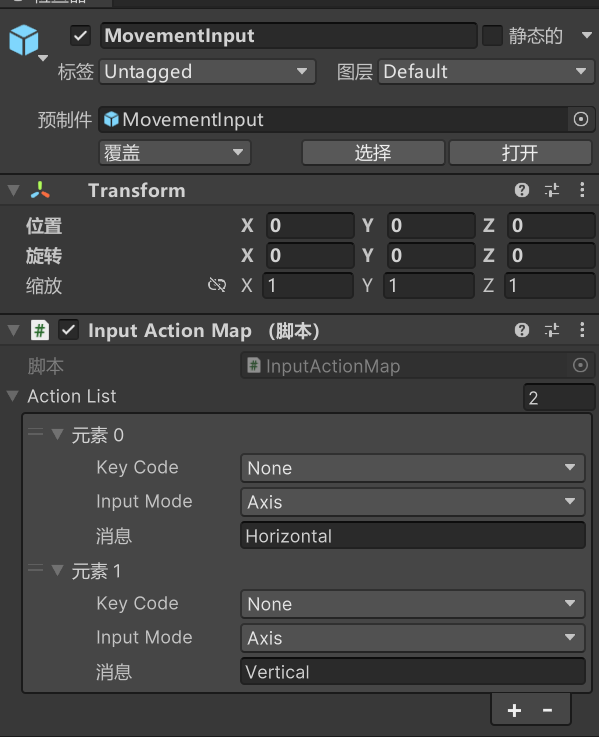
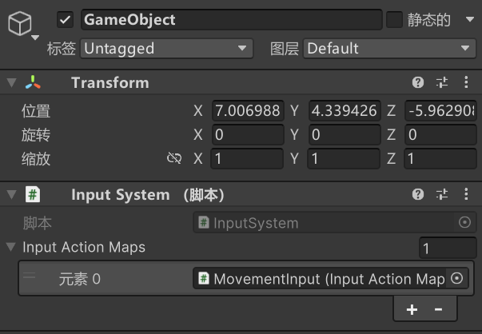
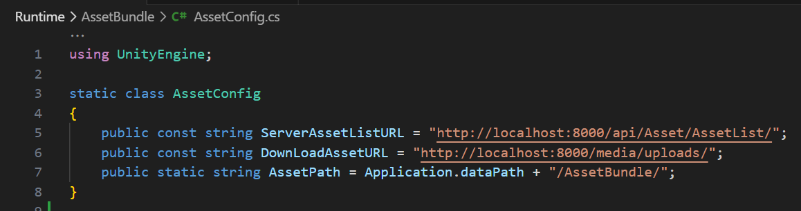
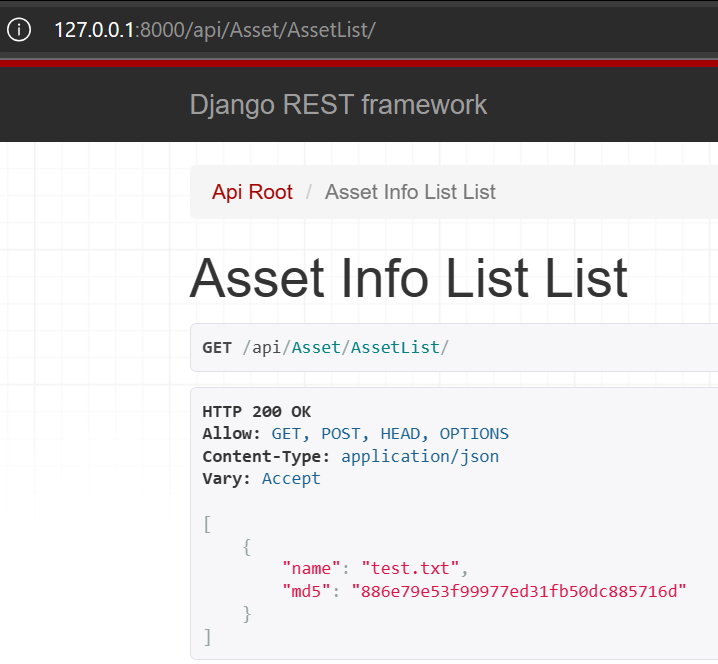
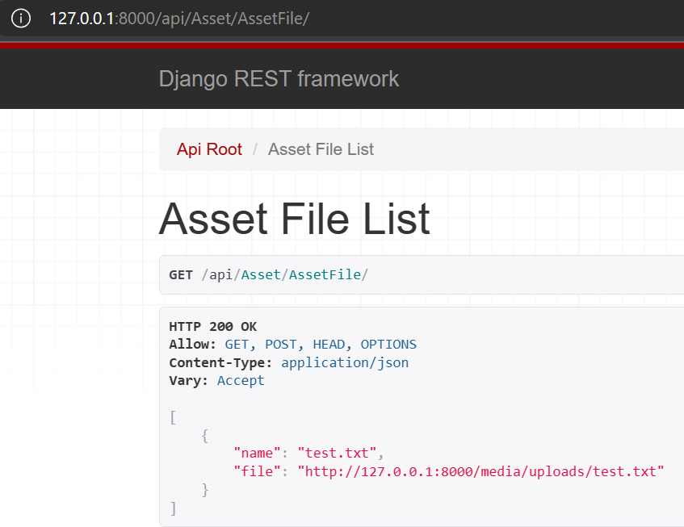

# Yummy Framework
一个简易的 Unity 框架

## 主要功能
- 事件总线
- 输入系统
- AB包热更
- 资源/场景异步加载
- 延迟任务计时器
  
## 未来待实现
- UI栈

## 事件总线
可以通过如下的方式发送事件，支持 Action 和 Func 。相较于 Unity 自带的事件系统采取了泛型的方式传递信息，避免了装箱拆箱。

```c#
// 注册事件
MessageBus.Instance.Register("Flag String", Func);
MessageBus.Instance.Register("Flag String", Action);
MessageBus.Instance.Register("Flag String", () =>
{
    // Do Something
});

// 发送事件
MessageBus.Instance.Send("Flag String", Args);
var retVal = MessageBus.Instance.SendWithRet("Flag String", Args);

// 移除事件
MessageBus.Instance.Remove("Flag String", Action);

// 清空所有事件
MessageBus.Instance.Clear();
```

## 输入系统
参考 UE5 中 Enhanced Input 的思想，将输入按键映射资产化，按键触发时会自动通过事件总线发送信息以调用相应的方法。



## AB包热更
可在`AssetConfig.cs` 文件中配置查询AB包列表的地址，以及下载文件的API前缀，还有AB包的存储位置。系统会利用 HTTP Get 请求下载相应文件并进行MD5校验，同时还会剔除过期的文件。



### 客户端调用方式
手动创建一个带有 AssetChecker 的 Game object，使用下面代码调用
```c#
MessageBus.Instance.Send(PublicAssetMessage.StartAssetCheck);
```

### 服务端(以Django为例)



## 资源/场景异步加载
AB包更新完毕后调用`AssetManager.cs`中的静态方法即可

## 延迟任务计时器
采用小根堆实现，可指定延迟事件，循环次数（小于等于0时无限循环，大于0时循环指定次数），事件取消时的回调。使用方式如下。

```c#
HeapTimer.Instance.AddTask(action, delay, loopTimes, onCancel);
```

## 依赖的库
LitJson: https://github.com/LitJSON/litjson